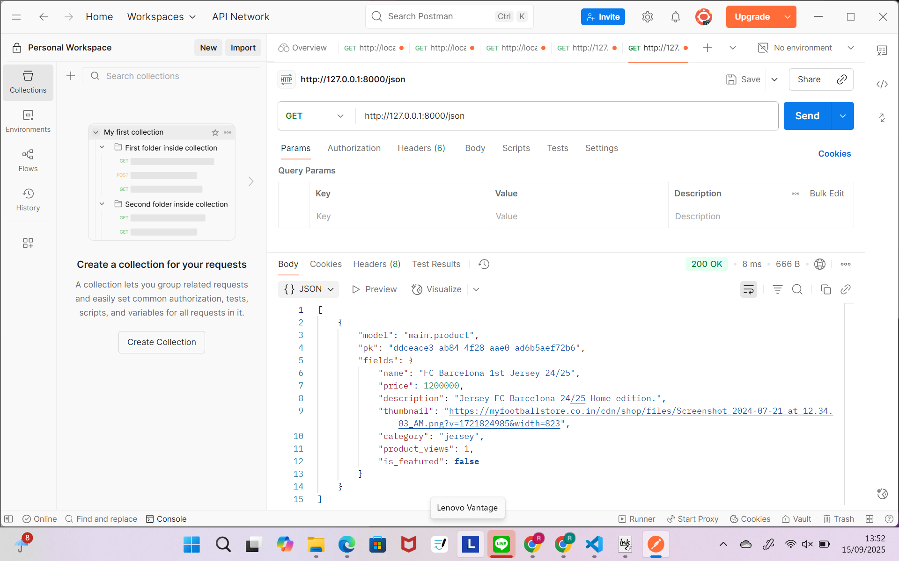
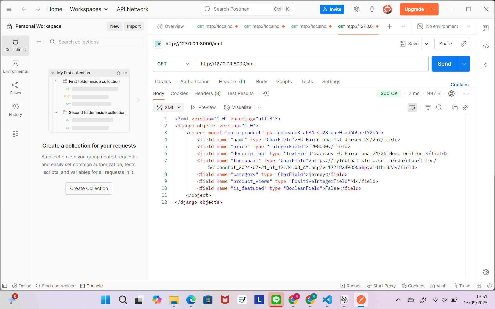
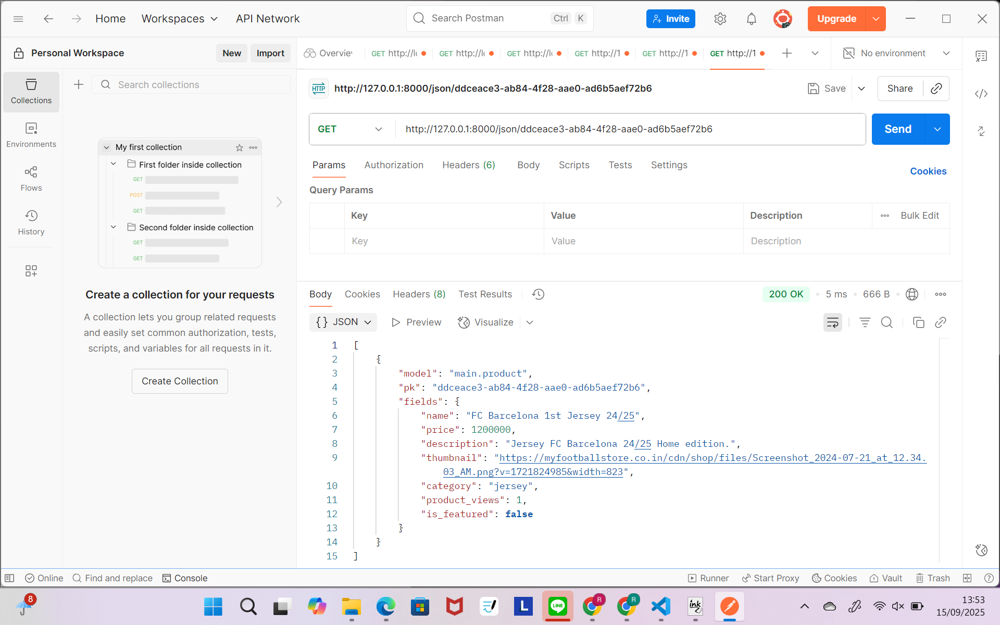
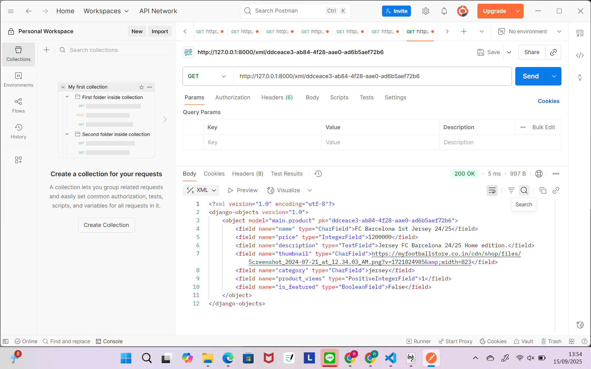

# PBP C 2025
```
Nama : Raida Khoyyara
NPM : 2406495445 
Kelas : PBP C
```

<details>
<summary>Tugas Individu 2</summary>

## TUGAS 2
Aplikasi dapat diakses di: https://raida-khoyyara-soccerest.pbp.cs.ui.ac.id/ 

### Jelaskan bagaimana cara kamu mengimplementasikan checklist di atas secara step-by-step (bukan hanya sekadar mengikuti tutorial).
1. Membuat folder proyek dan inisialisasi Git
Pertama saya membuat folder dulu untuk proyek ini dan langsung  diinisialisasi ke Git.
```
mkdir soccerest
cd soccerest
git init
```

2. Membuat dan mengaktifkan Virtual Environment
Supaya package-package nggak bentrok sama proyek lain, saya membuat virtual environment lalu diaktifin.
```
python -m venv env
env\Scripts\activate
```

3. Menginstal dependencies dan membuat proyek Django
Saya menginstall dulu semua kebutuhan dari requirements.txt, terus bikin proyek Django baru dengan nama soccerest.
```
pip install -r requirements.txt
django-admin startproject soccerest .
```

4. Membuat aplikasi main
Setelah itu saya membuat aplikasi baru namanya main, lalu ditambahin ke INSTALLED_APPS di settings.py.
```
python manage.py startapp main
```

5. Membuat model Product
Di file models.py aplikasi main, saya membuat model Product dengan atribut:
name (CharField)
price (IntegerField)
description (TextField)
thumbnail (URLField)
category (CharField)
is_featured (BooleanField)

6. Migrasi database
Supaya modelnya tersimpan ke database, saya menajlankan perintah ini:
```
python manage.py makemigrations
python manage.py migrate
```

7. Mengedit views.py dan routing di urls.py
Sya membuat fungsi di views.py buat nampilin nama aplikasi plus nama, NPM, dan kelas. Terus routing di urls.py biar bisa diakses lewat browser.

8. Testing secara lokal
Saya test dulu secara lokal untuk memastikan aplikasi bisa berjalan dengan benar.
```
python manage.py runserver
```
Kemudian saya membuka http://127.0.0.1:8000/ untuk mengecek apakah main.html sudah tampil.

9. Deployment ke PWS
Terakhir, Saya melakukan deployment ke PWS. Sebelum itu, saya menambahkan domain PWS ke ALLOWED_HOSTS pada settings.py. Setelah itu, proyeknya dipush ke repository GitHub yang terhubung dengan PWS agar aplikasi bisa diakses secara online.

## Buatlah bagan yang berisi request client ke web aplikasi berbasis Django beserta responnya dan jelaskan pada bagan tersebut kaitan antara urls.py, views.py, models.py, dan berkas html.
link bagan: https://drive.google.com/file/d/1k8htoqWfiT6n4lfWice-SIryXT5wU8v3/view?usp=sharing 
Pertama, ketika user mengakses aplikasi lewat browser, request itu masuk ke urls.py di level project.
Di sini, Django ngecek dulu apakah URL yang diminta sesuai dengan pola yang sudah kita definisikan. Kalau tidak sesuai, Django langsung balikin Error 404 – Page Not Found.

Kalau sesuai, request diteruskan ke urls.py di level aplikasi. Dari sini, Django tahu view mana yang harus dijalankan.

Selanjutnya masuk ke views.py, yang berfungsi sebagai otak logika aplikasi. Kalau view ini butuh data, dia akan memanggil models.py, yang jadi jembatan ke database lewat ORM.

Database akan ngasih balik data ke models, lalu diteruskan lagi ke views.
Di views, data itu dibungkus dalam bentuk context dan dikirim ke templates (HTML).

Templates ini kemudian dirender jadi halaman HTML final, dan akhirnya dikembalikan lagi ke client, sehingga user bisa lihat hasilnya di browser.

Tambahan, ada juga settings.py yang sebenarnya nggak dilewati langsung oleh request, tapi penting karena ngatur konfigurasi seperti database, template, dan apps yang aktif.

## Jelaskan peran settings.py dalam proyek Django!
settings.py berfungsi sebagai pusat pengaturan proyek Django. Semua konfigurasi penting ada di situ, mulai dari daftar aplikasi yang dipakai (INSTALLED_APPS), pengaturan database, bahasa, zona waktu, sampai konfigurasi keamanan seperti ALLOWED_HOSTS. Dengan kata lain, settings.py mengatur bagaimana proyek Django berjalan dan berinteraksi dengan lingkungan sekitarnya.

## Bagaimana cara kerja migrasi database di Django?
Migrasi pada Django merupakan mekanisme untuk memastikan struktur database selalu sesuai dengan model yang didefinisikan di models.py. Prosesnya terdiri atas dua tahap:
makemigrations – Django membuat file migrasi yang berisi instruksi perubahan database berdasarkan model yang dibuat atau diubah.
migrate – Django menjalankan instruksi tersebut agar tabel dan kolom di database benar-benar diperbarui sesuai dengan definisi model.
Dengan demikian, migrasi menjaga konsistensi antara kode program dengan database yang digunakan.

## Menurut Anda, dari semua framework yang ada, mengapa framework Django dijadikan permulaan pembelajaran pengembangan perangkat lunak?
Django dipilih sebagai permulaan karena memiliki beberapa keunggulan:

Lengkap tapi tetap sederhana: Sudah banyak fitur bawaan, seperti autentikasi, admin panel, dan ORM. Jadi kita bisa fokus ke konsep inti pengembangan.

Struktur proyek yang jelas: Django menekankan keteraturan melalui struktur folder dan file yang konsisten, sehingga membantu untuk memahami alur kerja proyek.

Dokumentasi dan komunitas yang kuat: ada banyak referensi resmi dan bantuan dari komunitas kalau ketemu masalah.

## Apakah ada feedback untuk asisten dosen tutorial 1 yang telah kamu kerjakan sebelumnya
Asisten dosen sudah sangat membantu dan memudahkan saya dalam memahami alur pembuatan proyek Django dari awal(Thank you so much esp Ka Marla). Saran saya, mungkin akan lebih membantu jika ditambahkan contoh kasus error yang umum terjadi saat praktik dan cara penanganannya.
</details>

<details>
<summary>Tugas Individu 3</summary>
## TUGAS INDIVIDU 3

### Jelaskan mengapa kita memerlukan data delivery dalam pengimplementasian sebuah platform?
Data delivery penting karena platform itu kan isinya banyak komponen (frontend, backend, database, API, dll). Nah biar semuanya nyambung, kita butuh mekanisme buat nganterin data. Kalau nggak ada data delivery, nanti datanya bisa nyasar, lambat, atau malah nggak sinkron. Intinya data delivery itu kaya kurir, yang pastiin info dari satu sisi (misalnya dari database ke tampilan web/UI).

### Menurutmu, mana yang lebih baik antara XML dan JSON? Mengapa JSON lebih populer dibandingkan XML?
Keduanya memiliki kelebihan dan kekurangan masing masing
XML: detail banget, bisa simpen data kompleks + atribut, tapi verbose/banyak syntaxnya, sulit dibaca, agak berat.
JSON: simpel, ringan, gampang dibaca, dan udah nyambung sama JavaScript.

Makanya sekarang JSON jauh lebih populer. Soalnya lebih efisien buat komunikasi antar sistem, parsing lebih cepat, dan semua bahasa modern udah dukung JSON. Kalau XML lebih cocok buat dokumen yang super kompleks, tapi di web/API, JSON lebih oke.

### Jelaskan fungsi dari method is_valid() pada form Django dan mengapa kita membutuhkan method tersebut?
is_valid() itu buat ngecek input user udah sesuai aturan validasi apa belum. Kalau valid return True dan kita bisa akses datanya lewat cleaned_data. Kalau nggak return False dan error-nya bisa langsung ditampilin di form. Kenapa penting? Biar data yang masuk ke sistem tuh bener, nggak ada yang aneh-aneh (contoh: harga negatif, email kosong, atau input random untuk nyerang sistem).

### Mengapa kita membutuhkan csrf_token saat membuat form di Django? Apa yang dapat terjadi jika kita tidak menambahkan csrf_token pada form Django? Bagaimana hal tersebut dapat dimanfaatkan oleh penyerang?
csrf_token itu sejenis keamanan. Jadi setiap kali kita bikin form (misalnya buat login atau nambah produk), kode itu ikut terkirim dan server akan ngecek apakah kodenya cocok sama yang sebelumnya diberikan. Kalau cocok, berarti request memang dari user. Kalau nggak cocok, server langsung nolak karena bisa aja itu dari pihak luar yang berbahaya.
Tanpa CSRF token, aplikasi bisa kena serangan Cross-Site Request Forgery (CSRF). Misalnya, kita lagi login di aplikasi bank, terus buka website lain yang diam-diam ngirim request transfer uang. Karena nggak ada CSRF token, server bank nggak bisa bedain mana request asli dan palsu, yang bisa aja bikin transaksi jalan tanpa sadar. Jadi, CSRF token adalah lapisan keamanan penting yang memastikan setiap request form benar-benar datang dari user, bukan dari penyerang.

### Jelaskan bagaimana cara kamu mengimplementasikan checklist di atas secara step-by-step (bukan hanya sekadar mengikuti tutorial).
1. Pertama, saya memastikan bahwa struktur repository sudah sesuai.

2. Selanjutnya, saya menambahkan direktori templates pada direktori utama. Di dalamnya, saya membuat berkas baru bernama base.html dan mengisinya dengan kode berikut:
```

<!DOCTYPE html>
<html lang="en">
<head>
    <meta charset="UTF-8" />
    <meta name="viewport" content="width=device-width, initial-scale=1.0" />
     
</head>

<body>
     
</body>
</html>
```

3. Setelah itu, saya menambahkan konfigurasi pada file settings.py di direktori soccerest agar Django dapat mengenali direktori templates:
```
TEMPLATES = [
    {
        'BACKEND': 'django.template.backends.django.DjangoTemplates',
        'DIRS': [BASE_DIR / 'templates'], # Tambahkan konten baris ini
        'APP_DIRS': True,
        ...
    }
]
```

4. Kemudian, saya menambahkan atau mengubah beberapa baris kode pada main.html, views.py, dan urls.py yang berada di dalam direktori main.

5. Untuk membuat dan menampilkan data pada HTML, saya juga membuat berkas baru bernama forms.py di dalam direktori main.

6. Selanjutnya, saya menambahkan dua berkas HTML baru, yaitu create_product.html dan product_detail.html, untuk kebutuhan tampilan form dan detail produk.

7. Agar aplikasi dapat berjalan dengan baik di PWS, saya menambahkan konfigurasi CSRF_TRUSTED_ORIGINS tepat setelah ALLOWED_HOSTS pada settings.py:
```
CSRF_TRUSTED_ORIGINS = [
    "<url-deployment-pws-kamu>"
]
```

8. Dan saya melakukan pengecekan secara lokal dengan menjalankan perintah:
```
python manage.py runserver 
```

9. Setelah bikin tampilan dasar dan form, sekarang saya tambahin fitur untuk menampilkan data dalam format XML.
Pertama, saya buka views.py di direktori main lalu import dulu:
```
from django.http import HttpResponse
from django.core import serializers
```

10. Lalu saya bikin fungsi baru show_xml dan show_json untuk ambil semua data dari model Product.

11. Setelah  bikin fungsi saya selalu buka urls.py untuk nambahin path 

12. Saya cek data pake postman juga. pertama run server dulu dengan masukin url ini :
```
http://localhost:8000/xml/ → semua data XML

http://localhost:8000/json/ → semua data JSON

http://localhost:8000/xml/[id]/ atau http://localhost:8000/json/[id]/ → data per ID
```

13. Terakhir saya push kode ini ke git dan pws 

14. Pada hari selasa(16/09) Saya menambahkan validasi bahwa input price tidak boleh negatif dengan menambahkan kode: 
```
<script>
  const priceInput = document.getElementById('id_price');

  if (priceInput) {
    priceInput.addEventListener('input', function() {
      if (this.value < 0) {
        this.setCustomValidity('Harga produk tidak boleh negatif.');
      } else {
        this.setCustomValidity('');
      }
    });
  }
</script>
```
kode ini berfungsi untuk menampilkan pesan validasi error bahwa price tidak boleh negatif. Lalu push lagi ke pws


### Apakah ada feedback untuk asdos di tutorial 2 yang sudah kalian kerjakan?

### Mengakses keempat URL di poin 2 menggunakan Postman, membuat screenshot dari hasil akses URL pada Postman, dan menambahkannya ke dalam README.md.

1. JSON (Semua Data)
http://127.0.0.1:8000/xml → endpoint yang balikin data dalam format XML.

2. XML (Semua Data)
http://127.0.0.1:8000/json → endpoint yang balikin data dalam format JSON.

3. JSON (Detail by UUID)
http://127.0.0.1:8000/json/ddceace3-ab84-4f28-aae0-ad6b5aef72b6 → ambil data detail tertentu (misalnya satu produk/objek) dalam JSON berdasarkan UUID.

4. XML (Detail by UUID) 
http://127.0.0.1:8000/xml/ddceace3-ab84-4f28-aae0-ad6b5aef72b6 → sama kayak nomor 3 tapi formatnya XML.

</details>

# TUGAS 4
## Apa itu Django AuthenticationForm? Jelaskan juga kelebihan dan kekurangannya.
AuthenticationForm di Django adalah form bawaan dari Django yang disediakan untuk melakukan proses login user. AuthenticationForm  juga udah built-in dan tinggal dipakai tanpa harus bikin form dari awal.

Kelebihannya:
- Gak perlu bikin form login manual, hemat waktu.
- Validasi otomatis (misalnya user gak ditemukan, password salah, dll).
- Terintegrasi langsung dengan sistem autentikasi Django.

Kekurangannya:
- Terlalu basic, jadi kalau mau custom field (misalnya login pakai email atau tambahin captcha), kita harus override.
- Tampilan default-nya juga sederhana banget, jadi tetap perlu kita modifikasi kalau mau UI/UX yang lebih menarik.

## Apa perbedaan antara autentikasi dan otorisasi? Bagaiamana Django mengimplementasikan kedua konsep tersebut?
Autentikasi (Authentication) itu proses untuk memastikan identitas pengguna. Otorisasi (Authorization) adalah proses untuk menentukan hak akses si user setelah user berhasil login. Misalnya:

Cara Django mengimplementasikan:
Autentikasi itu pakai authenticate(), login(), dan logout() yang built-in. Otorisasi dari django yg punya sistem permission dan @login_required untuk membatasi akses halaman. 

## Apa saja kelebihan dan kekurangan session dan cookies dalam konteks menyimpan state di aplikasi web?
SESSION
Kelebihan:
- Lebih aman karena data disimpan di server.
- Bisa nyimpan data kompleks (gak cuma string).
Kekurangan:
- Butuh penyimpanan server-side (misalnya di database atau memori).
- Kalau terlalu banyak data disimpan di session, bisa ngaruh ke performa server.

COOKIES
Kelebihan:
- Disimpan di sisi client, jadi gak membebani server.
- Cocok buat info kecil seperti last_login atau preferensi tampilan.
Kekurangan:
- Bisa dimodifikasi user, jadi gak aman untuk data sensitif.
- Ukuran terbatas (sekitar 4KB per cookie).

## Apakah penggunaan cookies aman secara default dalam pengembangan web, atau apakah ada risiko potensial yang harus diwaspadai? Bagaimana Django menangani hal tersebut?
Secara default, cookies tidak 100% aman, apalagi kalau kita asal simpan data sensitif. Risiko yang harus diwaspadai:
- Cookie theft (pencurian cookie): Kalau cookie gak dilindungi, bisa dicuri via serangan XSS.
- Manipulasi cookie: User bisa aja edit isi cookie-nya sendiri.
- Session hijacking: Kalau ada session ID di cookie, bisa disalahgunakan.

Django menangani ini dengan:
- Menyediakan opsi HttpOnly (biar cookie gak bisa diakses via JavaScript).
- Pakai SESSION_COOKIE_SECURE biar cookie cuma dikirim lewat HTTPS.
- Ada juga fitur SIGNED COOKIES, jadi isi cookie ditandatangani secara kriptografi (gak bisa diedit sembarangan).
- Tapi semua itu tetap tergantung kita sebagai developer—kita yang harus aktif mengatur setting keamanan tersebut.

## Jelaskan bagaimana cara kamu mengimplementasikan checklist di atas secara step-by-step (bukan hanya sekadar mengikuti tutorial).
1. Registrasi Pengguna
- Pertama-tama, aku mulai dari bikin fitur register.
Di views.py, aku import dulu UserCreationForm dan messages dari Django, terus aku bikin fungsi register():
```
import UserCreationForm dan messages

#fungsi register
def register(request):
    form = UserCreationForm()

    if request.method == "POST":
        form = UserCreationForm(request.POST)
        if form.is_valid():
            form.save()
            messages.success(request, 'Your account has been successfully created!')
            return redirect('main:login')
    context = {'form':form}
    return render(request, 'register.html', context)
```
- Habis itu aku buat file register.html di main/templates, isinya form buat user daftar:
```



<title>Register</title>




<div>
  <h1>Register</h1>

  <form method="POST">
    
    <table>
      {{ form.as_table }}
      <tr>
        <td></td>
        <td><input type="submit" name="submit" value="Daftar" /></td>
      </tr>
    </table>
  </form>

  
  <ul>
    
    <li>{{ message }}</li>
    
  </ul>
  
</div>


```
- Terakhir, aku tambahkan path-nya di urls.py supaya bisa diakses lewat URL.

2. Login Pengguna
- Setelah berhasil bikin register, aku lanjut ke fitur login.

Di views.py, aku import AuthenticationForm, login, dan authenticate. Terus aku buat fungsi login_user() kayak gini:
```
from django.contrib.auth.forms import UserCreationForm, AuthenticationForm
from django.contrib.auth import authenticate, login

def login_user(request):
   if request.method == 'POST':
      form = AuthenticationForm(data=request.POST)

      if form.is_valid():
            user = form.get_user()
            login(request, user)
            return redirect('main:show_main')

   else:
      form = AuthenticationForm(request)
   context = {'form': form}
   return render(request, 'login.html', context)
```
- Lalu aku buat template login.html supaya user bisa login lewat form-nya:
```



<title>Login</title>



<div class="login">
  <h1>Login</h1>

  <form method="POST" action="">
    
    <table>
      {{ form.as_table }}
      <tr>
        <td></td>
        <td><input class="btn login_btn" type="submit" value="Login" /></td>
      </tr>
    </table>
  </form>

  
  <ul>
    
    <li>{{ message }}</li>
    
  </ul>
   Don't have an account yet?
  <a href="">Register Now</a>
</div>


```
Terakhir, aku tambahkan route-nya juga di urls.py supaya bisa diakses lewat URL /login.

3. Logout Pengguna
- Setelah login, aku tambahkan fitur logout biar user bisa keluar. Di views.py, aku tambahkan fungsi logout_user() dan juga import logout:
 ```
 from django.contrib.auth import authenticate, login, logout
 ...
 def logout_user(request):
    logout(request)
    return redirect('main:login')
    ...
```
- Lalu aku tambahkan tombol logout di main.html:
```
<a href="">
  <button>Logout</button>
</a>
```
- aku tambahkan path-nya juga di urls.py:
```
from main.views import logout_user
...
path('logout/', logout_user, name='logout'),
...
```

4. Restriksi Akses ke Halaman Tertentu
- Supaya halaman tertentu (kayak main page atau product detail) nggak bisa diakses sembarangan, aku pakai login_required.

Di views.py, aku tambahin kode ini:
```
from django.contrib.auth.decorators import login_required
...
@login_required(login_url='/login')
def show_main(request):
...
@login_required(login_url='/login')
def product(request):
...
```

5. Menggunakan Data Dari Cookies
- aku implementasiin fitur buat nyimpen waktu terakhir user login pakai cookies.
Di fungsi login_user(), aku tambahkan baris ini setelah login berhasil:
```
import datetime
from django.http import HttpResponseRedirect
from django.urls import reverse
...
if form.is_valid():
    user = form.get_user()
    login(request, user)
    response = HttpResponseRedirect(reverse("main:show_main"))
    response.set_cookie('last_login', str(datetime.datetime.now()))
    return response
...
```
- Lalu di show_main(), aku ambil nilai cookie tersebut dan masukin ke context:
```
context = {
    'npm' : '240123456',
    'name': 'Haru Urara',
    'class': 'PBP A',
    'product': product_list,
    'last_login': request.COOKIES.get('last_login', 'Never')
}
```
- lalu mengubah fungsi logout_user untuk menghapus cookie last_login setelah melakukan logout.
```
def logout_user(request):
    logout(request)
    response = HttpResponseRedirect(reverse('main:login'))
    response.delete_cookie('last_login')
    return response
```

- Di main.html, aku tampilkan waktu login terakhirnya:
```
...
<h5>Sesi terakhir login: {{ last_login }}</h5>
...
```

- aku refresh dan jalanin local

6. Menghubungkan Model product dengan User
- Setelah fitur login dan logout beres, sekarang aku lanjut untuk menghubungkan tiap product dengan user yang membuatnya. Tujuannya, biar setiap user cuma bisa lihat dan kelola product yang dia sendiri yang buat.

- Pertama, aku buka file models.py di folder main. Terus aku tambahkan import ini di bagian atas:
```
from django.contrib.auth.models import User
```
- Lalu, di dalam kelas product, aku tambahin field baru buat nyimpan siapa user yang bikin product itu:
```
class product(models.Model):
    user = models.ForeignKey(User, on_delete=models.CASCADE, null=True)
    ...
```
- terus aku migrate 

7. Modifikasi Fungsi create_product
```
def create_product(request):
    form = ProductForm(request.POST or None)

    if form.is_valid() and request.method == 'POST':
        product_entry = form.save(commit=False)  # jangan langsung disave dulu
        product_entry.user = request.user        # simpan user yang login
        product_entry.save()
        return redirect('main:show_main')

    context = {'form': form}
    return render(request, "create_product.html", context)
```

8. Modifikasi show_main (Tampilan Halaman Utama)
- Aku juga modifikasi fungsi show_main supaya bisa memfilter product berdasarkan user yang sedang login:
```
@login_required(login_url='/login')
def show_main(request):
    filter_type = request.GET.get("filter", "all")  # default ke 'all'

    if filter_type == "all":
        product_list = product.objects.all()
    else:
        product_list = product.objects.filter(user=request.user)

    context = {
        'npm': '240123456',
        'name': request.user.username,
        'class': 'PBP A',
        'product_list': product_list,
        'last_login': request.COOKIES.get('last_login', 'Never')
    }
    return render(request, "main.html", context)
```

9. Tambah Tombol Filter di main.html
- Supaya user bisa milih mau lihat semua product atau cuma productnya sendiri, aku tambahin tombol di halaman main.html:
```
<a href="?filter=all">
    <button type="button">All Product</button>
</a>
<a href="?filter=my">
    <button type="button">My Product</button>
</a>
```

10. Menampilkan Nama Author di Detail product
- Terakhir, di halaman product_detail.html, aku tambahin bagian untuk nampilin siapa author dari product tersebut:
```

    <p>Author: {{ product.user.username }}</p>

    <p>Author: Anonymous</p>

```

11. Aku coba jalanin projectnya di local
```
python manage.py runserver
```

12. Membuat Functional Test di Django
- aku nambahin selenium ke requirements.txt. Selanjutnya jalankan pip install -r requirements.txt.
- aku coba test tapi dari template yang versi footballnews terus pake AI aku ubah jadi untuk kode ku yang sekarang.

13. push ke git dan pws namun gagal yakkk lagi lagi di pws

14. ternyata solusinya dengan hapus dbsqlnya, masukin kode 
```
python manage.py shell -c "from django.db import connection; cursor = connection.cursor(); cursor.execute('DROP SCHEMA tugas_individe CASCADE; CREATE SCHEMA tugas_individu;'); print('Schema reset!')"
```
dan migrate ulang langsung di pws. Dan berhasilll
